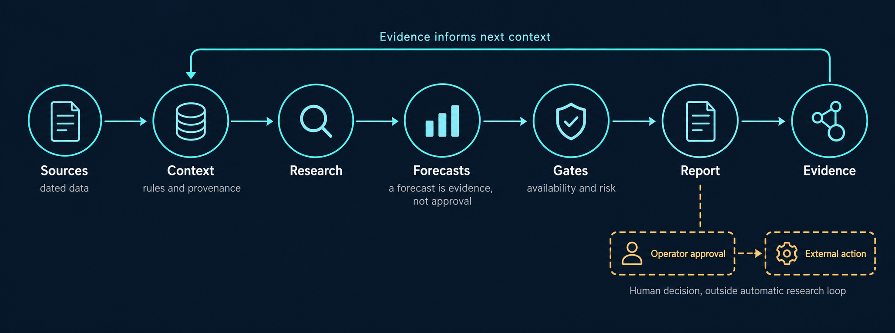

# System map and operating loop

[Guide](guide.md) · [Architecture](../ARCHITECTURE.md) · [Evaluation](evaluation-and-results.md) · [Privacy boundary](privacy-and-publication.md)



This new GPT-generated image is a navigation aid. The exact flow below is the source for component and approval boundaries.

```text
DATED SOURCES
  Public links, licensed or permitted market data, filings, dated holdings proxies
       |
       v
CONTEXT
  Source register + operator preferences + versioned research rules
       |
       v
RESEARCH
  Dated universe -> catalysts -> fundamentals -> daily price behavior
       |
       v
FORECAST EVIDENCE
  Optional model output with version, input cutoff, and fallback status
       |
       v
GATES
  Source freshness -> Cash App availability -> breadth and exhaustion
  -> insider and macro risk -> countercase
       |
       v
REPORT
  Dry-run brief + benchmark comparison + data-quality warnings
       |
       v
EVIDENCE
  Dated result + decision log + redacted public aggregate
       |__________________________________________> next context revision

REPORT -- separate operator approval --> EXTERNAL ACTION
         trade, broker write, email, or scheduler change

HISTORICAL REPLAY (separate evaluation path)
  dated features -> approved Cash App top 65 -> exact two non-proxy picks
  -> later full-market top 30 -> route and market-type results
  -> five-consecutive-qualified-week promotion gate
```

The research loop can stop at any gate. A forecast is supporting evidence, not approval. An unavailable stock stays a diagnostic candidate. A proposed sale needs a paired buy or an explicitly approved proceeds hold. A rendered report is not evidence of a sent email or executed order.

## Boundaries that matter

| Boundary | Required evidence |
| --- | --- |
| Source to research | Date, owner, permission or license status, and data freshness |
| Research to candidate | Company-specific catalyst, countercase, invalidation, and platform status |
| Candidate to historical score | Exactly two distinct approved non-proxy picks; full-market realized top-30 label; prior-only inputs |
| Score to promotion | Shared-window comparison, route and market-type checks, five consecutive qualified weeks |
| Report to external action | Separate operator authorization plus external readback for the action taken |

The [evaluation page](evaluation-and-results.md) explains why a portfolio return, a selector hit, and a delivery status are different observations.

## Canonical records

| Record | Required fields |
| --- | --- |
| Source | URL, owner, license or terms, retrieved date, role, confidence |
| Preference | benchmark, start date, risk, sectors, weights, schedule, delivery, trade authorization |
| Candidate | ticker, catalyst, catalyst date, evidence, countercase, invalidation, availability, forecasts |
| Action | side, ticker, amount or weight, paired action, settlement state, approval state |
| Observation | timestamp, portfolio return, benchmark return, spread, data freshness, cash-flow treatment |
| Decision | advice, operator choice, rationale, outcome, follow-up, unresolved uncertainty |
